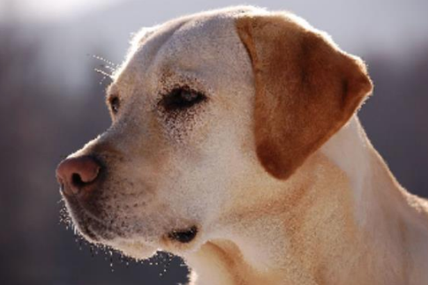

# Sam_Portfolio
Work in Progress...

# [Project 1 - AI Programming with Python course Project - Image Classifier](https://github.com/samux87/Image_Classifier)

This is a image classifier coded for the "Udacity's AI Programming with Python Nanodegree" program using neural networks.

The Image Classifier recognize different species of flowers (102 classes).

In this project, i first develop code for an image classifier built with PyTorch, then i converted it into a command line application.

# [Project 2 - Dog Breed Classifier](https://github.com/samux87/Dog_Breed_Classifier)

The purpose of this project is to classify the different dog breeds. In the world, exists a lot of breeds of dogs that differences one to another by a lot of parameters such as high, size, kind of employment, etc. 

For this project, the classification is totally based on images and the goal will be to classify 133 dog breeds using state of art deep learning algorithms to teach the computer how to give an estimation of a particular dog breed from an dog image.

An output example:

  
Dogs Detected: Golden retriever
